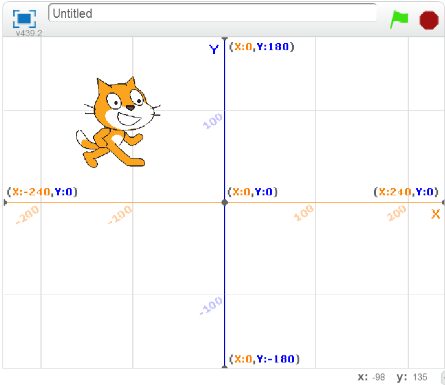
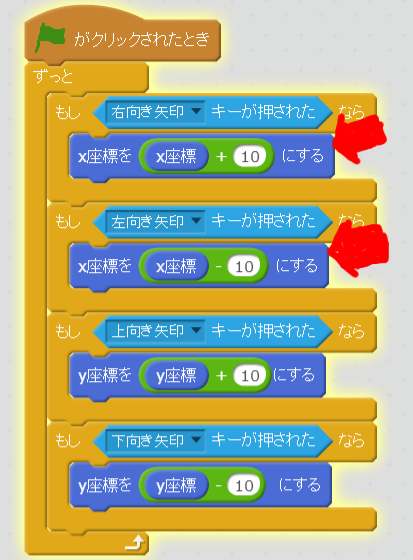
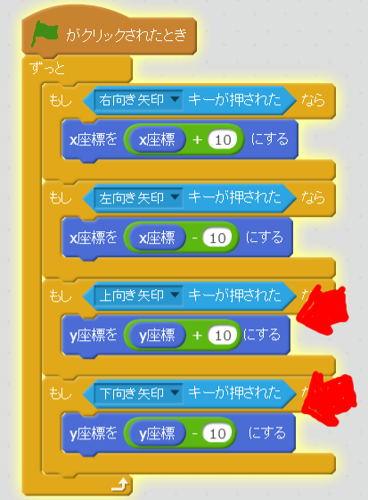

#XY座標について

「足し算」と「引き算」「X座標をxxにする」「y座標をxxにする」を利用して、キャラクターの位置はを変更できました。
これで、みなさんは、XY座標を利用することが出来るようになりまいた。学習したことをまとめてみましょう。

### Scratchのゲーム画面はXY座標で管理されている

Scratchのゲーム画面はXY座標が使われています。

#### X座標が左右で、Y座標が上下
##### [左右]
作成したゲーム上で、左キー、または、右キーを押してみてください。左右にキャラクターが動きますね。上下には動きません。

作成したスクリプトを見てみましょう。

左右キーを押した時は、X座標を操作するコマンドを追加しました。左右に移動するには、X軸の値を操作するようです。

##### [上下]
次は、上キー、または、下キーを押してみましょう。上下にキャラクターが動きますね。しかし、左右には動きません。

作成したスクリプトを見てみましょう。

上下キーを押した時は、Y座標を操作するコマンドを追加しました。上下に移動するには、Y軸の値を操作するようです。

