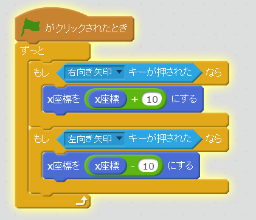

# 左(ひだり)に移動(いどう)する

左(ひだり)キーを押(お)したら、左(ひだり)に移動(いどう)するスクリプトを追加(ついか)してみよう。

追加(ついか)するスクリプトは、「右(みぎ)キーを押(お)したら右(みぎ)に移動(いどう)する」とほとんど同(おな)じです。

上記(じょうき)を参考(さんこう)にして機能追加(きのうついか)してみましょう。

#### 確認(かくにん)してみよう

https://scratch.mit.edu/projects/79028510/

(1) 右上(みぎうえ)の緑(みどり)の旗(はた)をクリックする

(2) 左(ひだり)キーを押(お)す

キャラクターが左(ひだり)に動(うご)いたらOKです。

