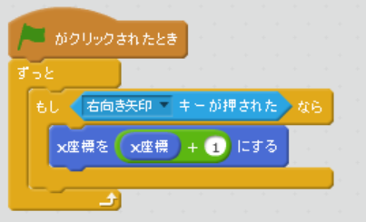
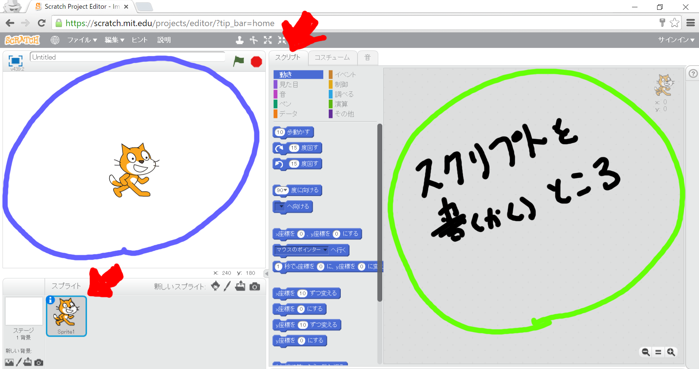
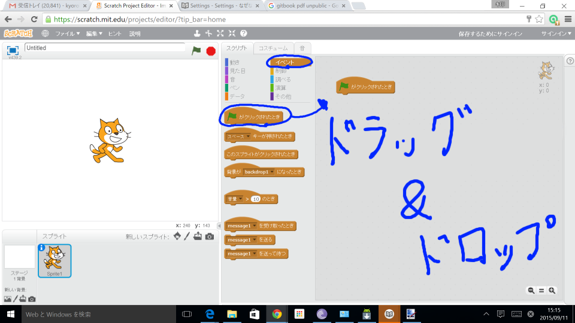
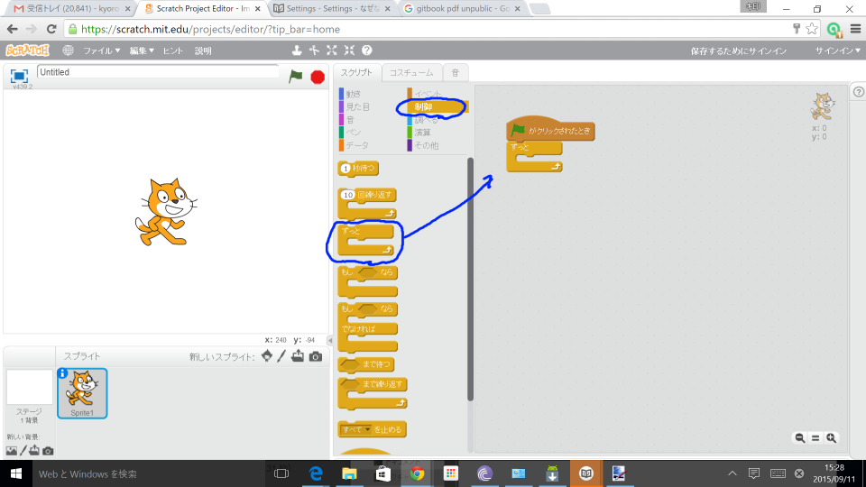
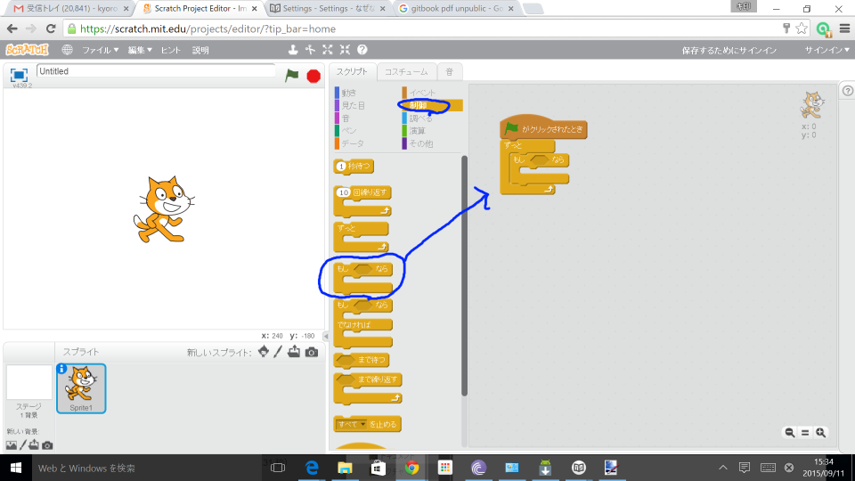
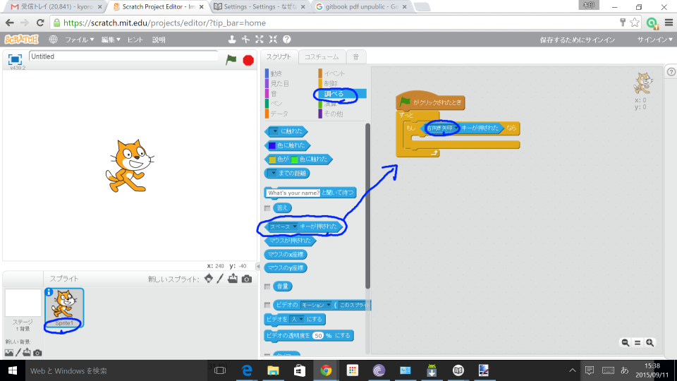
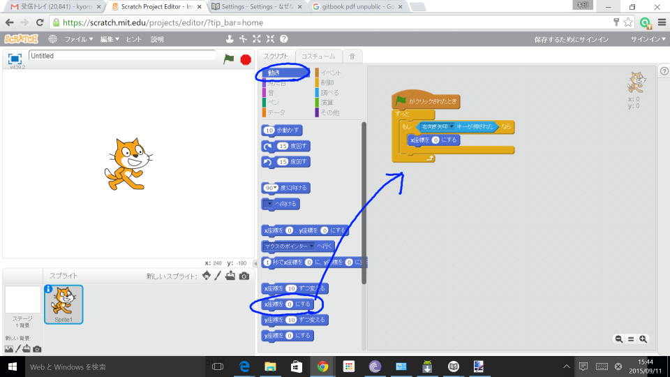
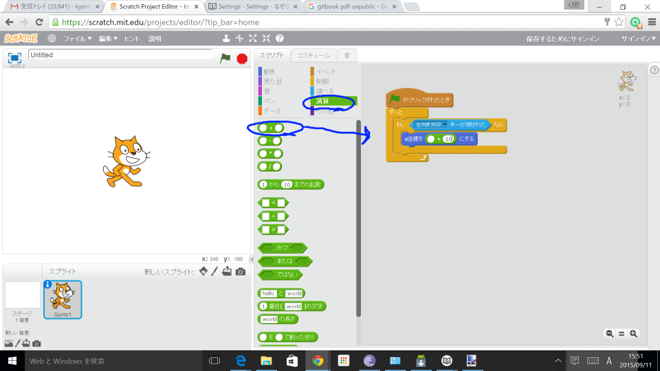
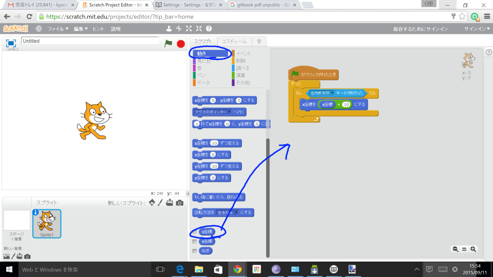

# 右に移動する

右キーを押したら、右に移動するスクリプトを追加してみよう。

## [1]スクリプト画面を表示しよう!!

##### [1-1] Sprite1を左クリック
##### [1-2] スクリプトを左クリック

## [2] スクリプトを追加しよう!!

##### [2-1] イベントの中から「フラッグがクリックされたとき」をスクリプトに追加する

##### [2-2] 制御の中から、「ずっと」を追加する。

##### [2-3] 制御の中から、「もしxxxなら」を追加する。

##### [2-4] 調べるの中から、「xxxキーが押されたとき」を追加する

##### [2-5] 「xxxキーが推されたとき」のxxxを「右向き矢印」に変える

##### [2-6] 動きの中から「x座標をxxxにする」を追加する

##### [2-7] 演算の中から「xx + yy」を追加する。

##### [2-8] 動きの中から「x座標」を追加する。

