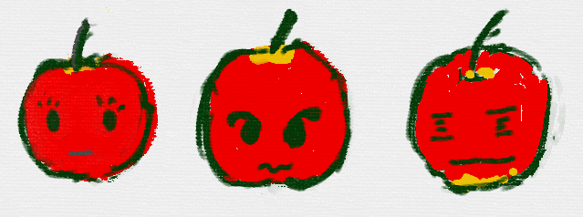
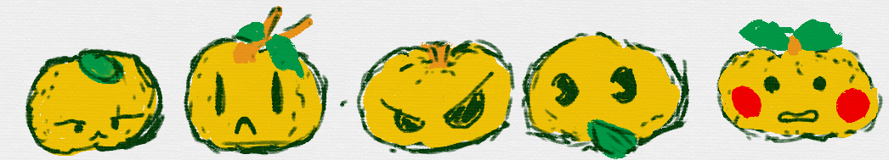
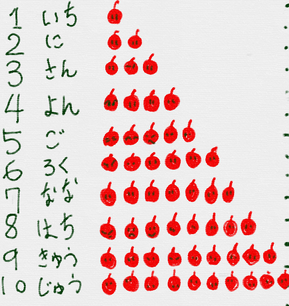
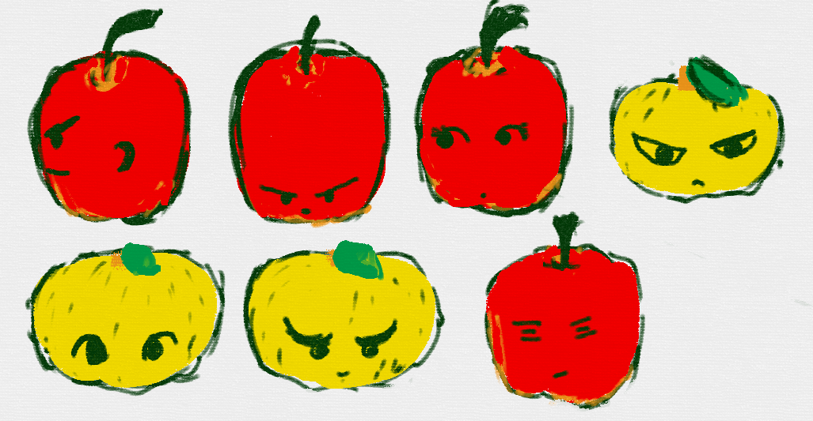

# 数字(すうじ)とは何(なに)か

## いくつあるかを伝えることができます

数を使う事で、いくつあるかを伝えることがでるようになります。

りんごが3個ある!!

みかんが5個ある!!

#### 1から10までの呼び方

#### 確認してみよう

##### Question みかんは何個ある?
 
 
 
##### Question リンゴは何個ある?
 
 
 
### 大きな値

星の数を数えよう

| 数字 |  |
| -- | -- |
|1|いち|★|
|2|に|★★|
|3|さん|★★★|
|4|よん|★★★★|
|5|ご|★★★★★|
|6|ろく|★★★★★★|
|7|なな|★★★★★★★|
|8|はち|★★★★★★★★|
|9|きゅう|★★★★★★★★★|
|10|じゅう|★★★★★★★★★★|
|11|じゅういち|★★★★★★★★★★★|
|12|じゅうさに|★★★★★★★★★★★★|
|13|じゅうさん|★★★★★★★★★★★★★
|14|じゅうよん|★★★★★★★★★★★★★★|
|15|じゅうご|★★★★★★★★★★★★★★★|
|16|じゅうろく|★★★★★★★★★★★★★★★★|
|17|じゅうなな|★★★★★★★★★★★★★★★★★|
|18|じゅうはち|★★★★★★★★★★★★★★★★★★|
|19|じゅうきゅ|★★★★★★★★★★★★★★★★★★★|
|20|にじゅう|★★★★★★★★★★★★★★★★★★★★|
|21|にじゅういち|★★★★★★★★★★★★★★★★★★★★★|
|22|にじゅうに|★★★★★★★★★★★★★★★★★★★★★★|
|23|にじゅうさん|★★★★★★★★★★★★★★★★★★★★★★★|
|24|にじゅうよん|★★★★★★★★★★★★★★★★★★★★★★★★|
|25|にじゅうご|★★★★★★★★★★★★★★★★★★★★★★★★★|
|26|にじゅうろく|★★★★★★★★★★★★★★★★★★★★★★★★★★|
|27|にじゅうなな|★★★★★★★★★★★★★★★★★★★★★★★★★★★|
|28|にじゅうはち|★★★★★★★★★★★★★★★★★★★★★★★★★★★★|
|29|にじゅうく|★★★★★★★★★★★★★★★★★★★★★★★★★★★★★|
|30|さんじゅう|★★★★★★★★★★★★★★★★★★★★★★★★★★★★★★|

### もっと大きな数を数えよう

| すうじ | よみかた|
| -- | -- |
| 1 | いち |
| 2 | に |
| 3 | さん |
| 4 | し |
| 5 | ご |
| 6 | ろく |
| 7 | なな |
| 8 | はち |
| 9 | きゅう|
| 10 | じゅう |
| 11 | じゅういち |
| 12 | じゅうに |
| 13 | じゅうさん |
| 14 | じゅうよん
| 15 | じゅうご |
| 16 | じゅうろく |
| 17 | じゅうしち |
| 18 | じゅうはち |
| 19 | じゅうく |
| 20 | にじゅう |
| 21 | にじゅいち |
| 22 | にじゅうに |
| 23 | にじゅうさん |
| 24 | にじゅうし |
| 25 | にじゅうご |
| 26 | にじゅろく |
| 27 | にじゅうしち |
| 28 | にじゅうはち |
| 29 | にじゅうく |
| 30 | さんじゅう |
| 31 | さんじゅういち |
| 32 | さんじゅうに |
| 33 | さんじゅうさん |
| 34 | さんじゅうし |
| 35 | さんじゅうご |
| 36 | さんじゅうろく |
| 37 | さんじゅうしち |
| 38 | さんじゅうはち |
| 39 | さんじゅうく |
| 40 | よんじゅう |
| 41 | よんじゅういち |
| 42 | よんじゅうに |
| 43 | よんじゅうさん |
| 44 | よんじゅうよん |
| 45 | よんじゅうご |
| 46 | よんじゅうろく |
| 47 | よんじゅうしち |
| 48 | よんじゅうはち |
| 49 | よんじゅうく |
| 50 | ごじゅう |
| 51 | ごじゅういち |
| 52 | ごじゅうに |
| 53 | ごじゅうさん |
| 54 | ごじゅうよん |
| 55 | ごじゅうご |
| 56 | ごじゅうろく |
| 57 | ごじゅうしち |
| 58 | ごじゅうはち |
| 59 | ごじゅうく |
| 60 | ろくじゅう |
| 61 | ろくじゅういち |
| 62 | ろくじゅうに |
| 63 | ろくじゅうさん |
| 64 | ろくじゅうよん |
| 65 | ろくじゅうご |
| 66 | ろくじゅうろく |
| 67 | ろくじゅうしち |
| 68 | ろくじゅうはち |
| 69 | ろくじゅうく |
| 70 | ななじゅう |
| 71 | ななじゅういち |
| 72 | ななじゅうに |
| 73 | ななじゅうさん |
| 74 | ななじゅうよん |
| 75 | ななじゅうご |
| 76 | ななじゅうろく |
| 77 | ななじゅうなな |
| 78 | ななじゅうはち |
| 79 | ななじゅうく |
| 80 | はちじゅう |
| 81 | はちじゅういち |
| 82 | はちじゅうに |
| 83 | はちじゅうさん |
| 84 | はちじゅうよん |
| 85 | はちじゅうご |
| 86 | はちじゅうろく |
| 87 | はちっじゅうしち |
| 88 | はちじゅうはち |
| 89 | はちじゅうく |
| 90 | きゅうじゅう|
| 91 | きゅうじゅういち |
| 92 | きゅうじゅうに |
| 93 | きゅうじゅさん |
| 94 | きゅうじゅうよん |
| 95 | きゅうじゅうご |
| 96 | きゅうじゅうろく |
| 97 | きゅうじゅうしち|
| 98 | きゅうじゅうはち |
| 99 | きゅうじゅうきゅう |
| 100 | ひゃく |
| 101 | ひゃくいち|
| 102 | ひゃくに |
| 103 | ひゃくさん |
| 104 | ひゃくし |
| 105 | ひゃくご |
| 106 | ひゃくろく |
| 107 | ひゃくなな |
| 108 | ひゃくはち |
| 109 | ひゃくきゅう|
| 110 | ひゃくじゅう |
| 111 | ひゃくじゅういち |
| 112 | ひゃくじゅうに |
| 113 | ひゃくじゅうさん |
| 114 | ひゃくじゅうよん
| 115 | ひゃくじゅうご |
| 116 | ひゃくじゅうろく |
| 117 | ひゃくじゅうしち |
| 118 | ひゃくじゅうはち |
| 119 | ひゃくじゅうく |
| 120 | ひゃくにじゅう |
| 121 | ひゃくにじゅいち |
| 122 | ひゃくにじゅうに |
| 123 | ひゃくにじゅうさん |
| 124 | ひゃくにじゅうし |
| 125 | ひゃくにじゅうご |
| 126 | ひゃくにじゅろく |
| 127 | ひゃくにじゅうしち |
| 128 | ひゃくにじゅうはち |
| 129 | ひゃくにじゅうく |
| 130 | ひゃくさんじゅう |
| 131 | ひゃくさんじゅういち |
| 132 | ひゃくさんじゅうに |
| 133 | ひゃくさんじゅうさん |
| 134 | ひゃくさんじゅうし |
| 135 | ひゃくさんじゅうご |
| 136 | ひゃくさんじゅうろく |
| 137 | ひゃくさんじゅうしち |
| 138 | ひゃくさんじゅうはち |
| 139 | ひゃくさんじゅうく |
| 140 | ひゃくよんじゅう |
| 141 | ひゃくよんじゅういち |
| 142 | ひゃくよんじゅうに |
| 143 | ひゃくよんじゅうさん |
| 144 | ひゃくよんじゅうよん |
| 145 | ひゃくよんじゅうご |
| 146 | ひゃくよんじゅうろく |
| 147 | ひゃくよんじゅうしち |
| 148 | ひゃくよんじゅうはち |
| 149 | ひゃくよんじゅうく |
| 150 | ひゃくごじゅう |
| 151 | ひゃくごじゅういち |
| 152 | ひゃくごじゅうに |
| 153 | ひゃくごじゅうさん |
| 154 | ひゃくごじゅうよん |
| 155 | ひゃくごじゅうご |
| 156 | ひゃくごじゅうろく |
| 157 | ひゃくごじゅうしち |
| 158 | ひゃくごじゅうはち |
| 159 | ひゃくごじゅうく |
| 160 | ひゃくろくじゅう |
| 161 | ひゃくろくじゅういち |
| 162 | ひゃくろくじゅうに |
| 163 | ひゃくろくじゅうさん |
| 164 | ひゃくろくじゅうよん |
| 165 | ひゃくろくじゅうご |
| 166 | ひゃくろくじゅうろく |
| 167 | ひゃくろくじゅうしち |
| 168 | ひゃくろくじゅうはち |
| 169 | ひゃくろくじゅうく |
| 170 | ひゃくななじゅう |
| 171 | ひゃくななじゅういち |
| 172 | ひゃくななじゅうに |
| 173 | ひゃくななじゅうさん |
| 174 | ひゃくななじゅうよん |
| 175 | ひゃくななじゅうご |
| 176 | ひゃくななじゅうろく |
| 177 | ひゃくななじゅうなな |
| 178 | ひゃくななじゅうはち |
| 179 | ひゃくななじゅうく |
| 180 | ひゃくはちじゅう |
| 181 | ひゃひゃくくはちじゅういち |
| 182 | ひゃくはちじゅうに |
| 183 | ひゃくはちじゅうさん |
| 184 | ひゃくはちじゅうよん |
| 185 | ひゃくはちじゅうご |
| 186 | ひゃくはちじゅうろく |
| 187 | ひゃくひゃくはちっじゅうしち |
| 188 | ひゃくひゃくはちじゅうはち |
| 189 | ひゃくひゃくひゃくはちじゅうく |
| 190 | ひゃくひゃくきゅうじゅう|
| 191 | ひゃくひゃくきゅうじゅういち |
| 192 | ひゃくきゅうじゅうに |
| 193 | ひゃくきゅうじゅさん |
| 194 | ひゃくきゅうじゅうよん |
| 195 | ひゃくきゅうじゅうご |
| 196 | ひゃくきゅうじゅうろく |
| 197 | ひゃくひゃくきゅうじゅうしち|
| 198 | ひゃくきゅうじゅうはち |
| 199 | ひゃくきゅうじゅうきゅう |

