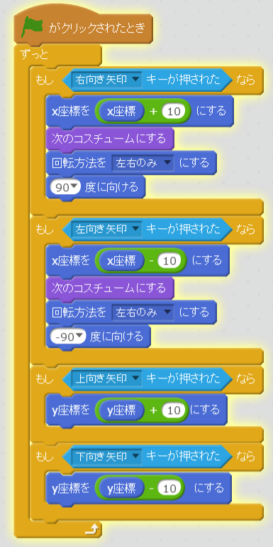
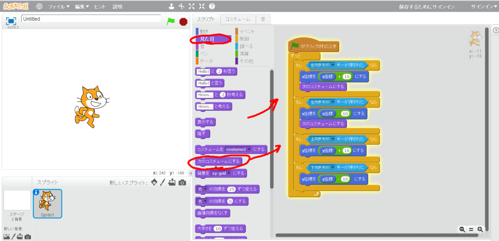
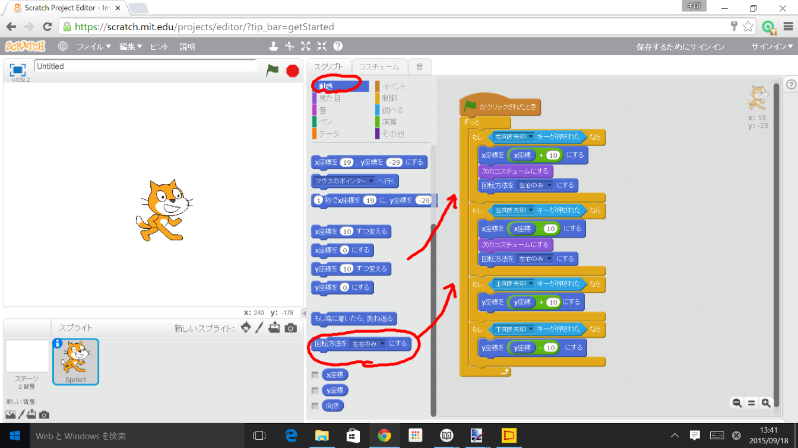
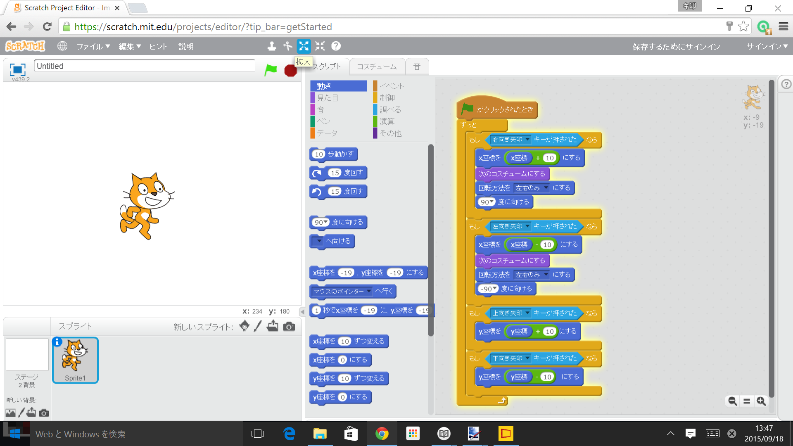

# 歩行アニメーション

歩行アニメーションを追加しましょう。右キー、左キーでキャラクターが移動時に歩行アニメーションさせます。

## [1] キャラクターが移動するたびに、コスチュームを変える

### [1-1] 「見た目」から「次のコスチュームにする」を追加する。

## [2] 左に移動するときは、左を向くようにする

### [2-1] 「動き」から、「回転方法をxxxにする」を追加する

### [2-3] 「動き」から、「xx度に向ける」を追加する。

